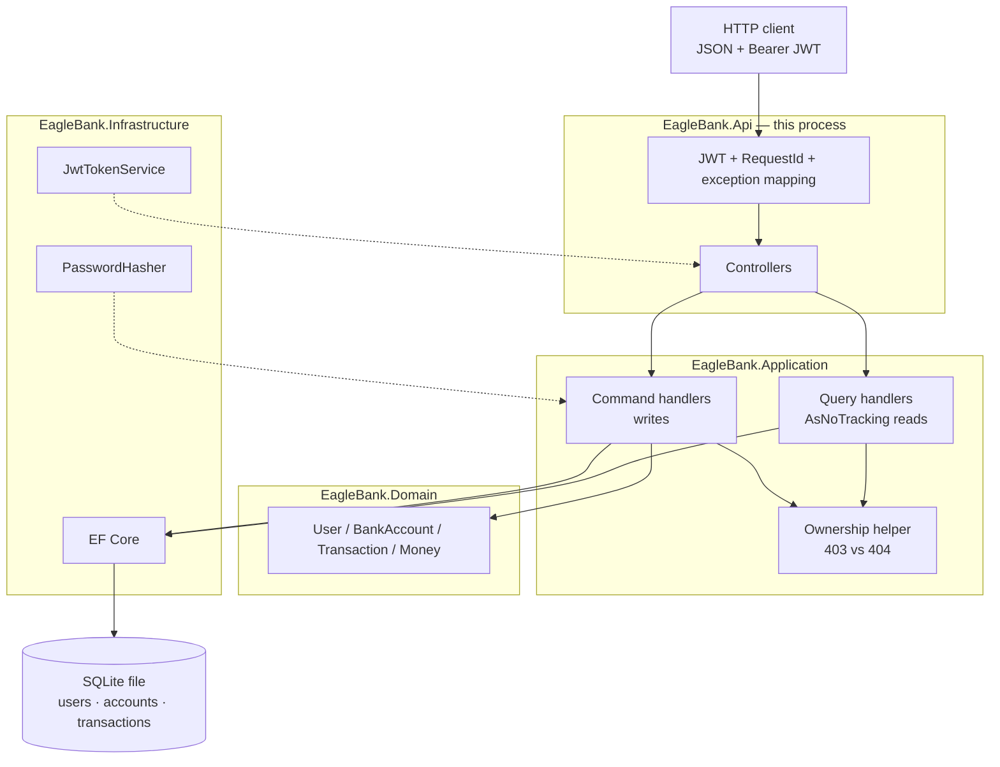

# System Design

## 1. Design summary

Eagle Bank will be a single ASP.NET Core 10 Web API that implements the approved requirements and the attached OpenAPI contract. Callers register with email and password, obtain a JWT from `POST /v1/auth/login`, and then manage only their own user, accounts, and transactions.

The recommended shape is a small clean architecture with **lightweight CQRS** in Application: thin controllers dispatch one command or query handler each, a domain model owns money and balance invariants, and EF Core over SQLite persists a single model. Controllers do not contain business rules. Every layer writes structured logs keyed by `RequestId`; PII and secrets are never logged (ADR-0007).

These design choices were **explicitly approved** on 2026-09-05. Alternatives remain recorded in ADRs.

## 2. Goals and non-goals

**Goals**

- Satisfy the approved MVP: create/fetch user, login, create/fetch account, create deposit, fetch transaction, plus matching error cases.
- Keep stretch endpoints (withdrawal, list, PATCH, DELETE) as new command/query handlers so they do not edit MVP handlers.
- Make ownership, validation, and money rules easy to explain and test.
- Stay runnable locally with documented commands.
- Emit structured logs on every layer for request traceability, with no PII.

**Non-goals**

- UI, payment rails, KYC, multi-currency, transfers, or an identity provider.
- High availability, event sourcing, a separate read database, a ledger service, event-driven architecture (ADR-0009), an application cache / Redis in this submission (ADR-0010), or production rate-limiting / SAST pipelines in this submission (ADR-0011). Application-level CQRS (one handler per use case, one store) is in scope (ADR-0008).
- Generating a second OpenAPI contract that replaces `openapi.yaml`.

## 3. Requirement traceability

| Design element | Requirements |
|---|---|
| Public `POST /v1/users` + password field | REQ-USER-001–005, REQ-AUTH-002, REQ-AUTH-004 |
| JWT login and bearer middleware | REQ-AUTH-001–005, REQ-ERR-001 |
| Ownership checks `403` vs `404` | REQ-USER-007–008, REQ-ACCOUNT-008–009, REQ-TXN-008–009, REQ-AUTH-006–007 |
| Account number `01######`, sort code `10-10-10`, GBP | REQ-ACCOUNT-004, REQ-API-008 |
| Balance only changes via successful transactions | REQ-DATA-003, REQ-TXN-005–007 |
| Atomic transaction + no overdraft | REQ-TXN-016, REQ-DATA-004 |
| Deposit cap `10000.00` on resulting balance | Q-006 |
| Delete user blocked if accounts exist | REQ-USER-012, REQ-DATA-005 |
| Account delete removes account and hides transactions | REQ-ACCOUNT-011, REQ-DATA-006, A-010 |
| Contract-shaped errors | REQ-API-004–005, REQ-ERR-001–008 |
| `decimal`-safe money | REQ-NFR-004 |
| Password hashing; secret not committed | REQ-NFR-005 |
| .NET 10 | REQ-NFR-001 |
| Tests for MVP paths | REQ-TEST-001, REQ-TEST-004 |
| Layered structured logging, no PII | REQ-ERR-007, REQ-ERR-008, REQ-NFR-005, REQ-DEL-003, ADR-0007 |
| One command/query handler per use case | REQ-NFR-003, ADR-0008 |
| Synchronous write path; no EDA | REQ-NFR-006, REQ-TXN-016, REQ-DATA-004, ADR-0009 |
| No cache in submission; production cache must not own balance | REQ-NFR-006, REQ-DATA-003, ADR-0010 |
| Production rate limiting and SAST across the SDLC | REQ-NFR-005, REQ-DEL-003, ADR-0011 |

## 4. Proposed architecture



Production-only (not drawn in the runtime box): edge rate limiting, SAST/SCA in CI, PostgreSQL swap, optional user-profile cache. No broker and no Redis for balances.

```text
HTTP JSON
    │
    ▼
EagleBank.Api          controllers, JWT, exception → HTTP mapping
    │
    ▼
EagleBank.Application  commands / queries → one handler each (ADR-0008)
    │
    ▼
EagleBank.Domain       User, BankAccount, Transaction, Money, invariants
    │
    ▼
EagleBank.Infrastructure   EF Core, SQLite, PasswordHasher, JwtTokenService
```

Application folders are sliced by use case, for example `Users/CreateUser`, `Users/GetUser`, `Accounts/CreateAccount`, `Transactions/CreateTransaction`. Shared ownership and mapping helpers live beside them so they are not copy-pasted. Queries use the same tables with `AsNoTracking()`. There is no second read model.

**Proposed solution layout**

```text
EagleBank.sln
src/EagleBank.Api
src/EagleBank.Application
src/EagleBank.Domain
src/EagleBank.Infrastructure
tests/EagleBank.Tests
openapi.yaml
```

Controllers are the HTTP boundary (ADR-0001). Each action injects the handler for that command or query (ADR-0008), not a multi-method application service. Dependency injection is the default ASP.NET Core container: API registers Infrastructure implementations of Application ports.

## 5. Component responsibilities

| Component | Responsibility | Must not |
|---|---|---|
| Controllers | Bind JSON/path params, dispatch one command or query, return status + body; open a log scope | Own balance rules, hash passwords, run SQL, log bodies |
| Command handlers | Mutating use cases: validate orchestration, authorise, call domain, save | Serve reads; depend on ASP.NET types; log PII |
| Query handlers | Read-only use cases: load, authorise, map response (`AsNoTracking`) | Mutate balance or insert transactions |
| Exception handler | Map domain/application exceptions to OpenAPI error bodies; log outcome with `RequestId` | Catch and swallow invariant failures; log exception messages that contain PII |
| Auth middleware | Validate JWT; set current `userId`; put `userId` in the log scope | Decide resource ownership; log the token or `Authorization` header |
| Shared application helpers | Ownership `403`/`404`, email uniqueness, DTO mapping | Become a second god service |
| Domain | IDs, money, balance invariants, immutability of transactions; log invariant rejection by reason code | Know HTTP or EF; log monetary amounts, account numbers, or personal fields |
| Repositories / DbContext | Persist aggregates; run the balance update in one database transaction; log persist success/failure by entity type | Encode HTTP status codes; enable EF sensitive-data logging |
| JwtTokenService | Issue tokens with `sub` = `userId` | Persist tokens; log token strings |
| PasswordHasher | Hash and verify passwords | Log plaintext or hash values |
| Request logging | One structured line per request: method, route template, status, elapsed, `RequestId` | Log raw URLs, query strings, or headers that carry credentials |

## 6. Domain model

```text
User
  id: usr-{alnum}+
  name, address, phoneNumber, email (unique)
  passwordHash
  createdTimestamp, updatedTimestamp
  accounts: 0..*

BankAccount
  accountNumber: 01 + 6 digits
  userId
  sortCode: "10-10-10"
  name
  accountType: personal
  balance: Money (GBP, >= 0.00, <= 10000.00)
  createdTimestamp, updatedTimestamp
  transactions: 0..*

Transaction  (immutable after create)
  id: tan-{alnum}+
  accountNumber
  userId
  amount: Money
  currency: GBP
  type: deposit | withdrawal
  reference?: string
  createdTimestamp
```

**Invariants**

- A transaction is append-only. No update/delete methods on the type.
- `BankAccount.Apply(transaction)` is the only way to change `balance`.
- Deposit: `balance + amount <= 10000.00` or reject.
- Withdrawal: `amount <= balance` or reject (insufficient funds).
- `User` cannot be deleted while it has accounts.
- Deleting an account removes it and its transactions from the store (A-010).
- Email uniqueness is enforced in persistence and treated as a validation failure (`400`).

**Money** (ADR-0003): a value object with currency `GBP` and a `decimal` major-unit amount scaled to two decimal places. Persistence stores integer pence (`amount * 100`) so SQLite cannot corrupt scale.

**ID generation**

- User: `usr-` + 12+ URL-safe alphanumeric characters.
- Transaction: `tan-` + 12+ alphanumeric characters (Q-003).
- Account number: `01` + six random digits; retry on unique-index collision.

## 7. API request flows

Each flow is one handler. Controllers only assemble the command/query and map the result to HTTP.

### Create user — `POST /v1/users` (anonymous)

1. Validate body (required fields, E.164 phone, email, password present).
2. Reject duplicate email with `400`.
3. Hash password; generate `usr-…`; persist; return `201` `UserResponse` (no password).

### Login — `POST /v1/auth/login` (anonymous)

1. Validate `{ email, password }`.
2. Look up user by email. If missing or password fails, return `401` with the same message (do not leak which failed).
3. Return `200` `{ "token": "<jwt>" }`.

### Authenticated resource access

1. Missing/invalid JWT → `401` (middleware).
2. Load resource by path id.
3. Missing → `404`.
4. Exists but `ownerId != token.sub` → `403`.
5. Continue with the use case.

### Create account — `POST /v1/accounts`

Owner comes from the token. Persist `balance = 0.00`. Return `201`.

### Create transaction — `POST /v1/accounts/{accountNumber}/transactions`

1. Validate amount (`> 0`, two decimals, `<= 10000.00`), currency `GBP`, type enum.
2. Authorise account (`404` / `403`).
3. Open a database transaction; apply deposit or withdrawal (ADR-0004).
4. Persist immutable transaction row and new balance together; commit.
5. Return `201`. On insufficient funds or cap breach, roll back and return `422`.

### Fetch transaction

Authorise account first. If the transaction id is unknown or belongs to another account, `404` (REQ-TXN-012/013).

### Delete user (stretch)

If the user has any account, `409`. Otherwise delete user `204`.

### Delete account (stretch)

Delete account and its transactions; `204`. Subsequent fetches are `404`.

## 8. Persistence and data model

**Proposed:** EF Core 10 + SQLite file (ADR-0002). One database transaction per mutating use case.

| Table | Keys / notes |
|---|---|
| `users` | PK `id`; unique `email`; `password_hash`; address columns (or JSON); timestamps |
| `accounts` | PK `account_number`; FK `user_id`; `balance_pence` INTEGER; unique account number |
| `transactions` | PK `id`; FK `account_number` ON DELETE CASCADE; `amount_pence`; `type`; `user_id`; immutable rows |

Indexes: `users.email`, `accounts.user_id`, `transactions.account_number`.

Migrations live in Infrastructure and are applied on startup in Development, or via an explicit `dotnet ef` command documented in the README.

Tests use the same EF model against a private SQLite database per test fixture (ADR-0006).

## 9. Transaction and concurrency behaviour

Balance and the new transaction row are written in one EF/database transaction (REQ-TXN-016, REQ-DATA-004).

**Proposed concurrency control** (ADR-0004): conditional update in the same transaction:

- Withdrawal: update the account only when `balance_pence >= amount_pence`. Zero rows → `422`, no insert.
- Deposit: update only when `balance_pence + amount_pence <= 1000000` (pence for `10000.00`). Zero rows → `422`.

SQLite serialises writers, so this is sufficient for the take-home. A pairing follow-up could switch the same ports to PostgreSQL `SELECT … FOR UPDATE`.

Failed validation, authn, authz, or `422` does not commit a transaction row or a balance change.

## 10. Validation and errors

**Proposed:** FluentValidation on request DTOs, plus domain checks for balance rules.

| Failure | HTTP | Body |
|---|---|---|
| Missing/invalid fields, bad path format, duplicate email | `400` | `BadRequestErrorResponse` (`message`, `details[].field/message/type`) |
| Missing/invalid/expired JWT; bad login | `401` | `ErrorResponse` |
| Authenticated but not owner | `403` | `ErrorResponse` |
| Unknown user/account/transaction, or transaction/account mismatch | `404` | `ErrorResponse` |
| Delete user while accounts exist | `409` | `ErrorResponse` |
| Insufficient funds or deposit would exceed `10000.00` | `422` | `ErrorResponse` |
| Unhandled exception | `500` | `ErrorResponse` without stack traces or secrets |

Application exceptions (`NotFoundException`, `ForbiddenException`, `ConflictException`, `InsufficientFundsException`, `BalanceCapException`) are mapped in one API exception handler.

`POST /v1/users` `400` uses the same `BadRequestErrorResponse` shape even though the original spec omitted a schema.

## 11. Security

- `POST /v1/users` and `POST /v1/auth/login` are anonymous. All other `/v1` routes require JWT bearer (ADR-0005).
- JWT `sub` (and a `userId` claim if useful) is the only owner identity. Clients cannot set `userId` on account or transaction create.
- Passwords hashed with `PasswordHasher<T>` (PBKDF2). Never returned or logged (including hashes).
- Signing key from configuration / environment (`Jwt:SigningKey`), minimum 32 characters, not committed. Development can use user-secrets or a local untracked env file.
- Tokens: HMAC-SHA256, proposed expiry 60 minutes.
- JSON serializer: `System.Text.Json`, camelCase. Do not serialize password fields on user responses.
- **Production rate limiting (not this submission):** apply at the gateway or ASP.NET `RateLimiter` before handlers. Strictest quotas on `POST /v1/auth/login` and `POST /v1/users` (per IP) to slow credential stuffing and signup abuse; authenticated routes may also limit per `userId`. Over-limit responses are `429` + `Retry-After` + `ErrorResponse`. Do not log the identity being guessed (ADR-0011).
- **SAST across the SDLC (not a one-off release scan):** static analysis should run in most lifecycle stages so vulnerabilities are found when they are cheapest to fix — IDE/pre-commit where practical, every pull request/CI build, scheduled full-branch scans, and a release gate that fails on new high/critical issues. Complement SAST with SCA (dependency CVEs) and secrets scanning. SAST does not replace DAST, peer review, or the design controls above (ADR-0011).

## 12. Observability

Every layer logs. Logs exist for traceability, not for dumping payloads. No APM or log warehouse is required for the take-home. Optional stretch: `/health`.

### Correlation

- Generate a `RequestId` (GUID) at the API edge if the caller did not send `X-Request-Id`.
- `ILogger.BeginScope` includes `RequestId` and, after authentication, `userId` (`usr-…` only).
- Downstream layers do not invent a second correlation id; they use the scope.

### What each layer logs

| Layer | Events | Example fields (allow-list) |
|---|---|---|
| Api | Request started/completed; authn failure; mapped exception | `RequestId`, HTTP method, **route template**, status code, elapsed ms, exception type |
| Application | Command/query started, authorised, succeeded, or failed | `RequestId`, `userId`, handler/command name, result (`Created`, `Forbidden`, `NotFound`, `Conflict`, `InsufficientFunds`, `BalanceCap`) |
| Domain | Invariant rejected | Reason code only (`InsufficientFunds`, `BalanceCap`, `InvalidAmountScale`) |
| Infrastructure | Persist committed/rolled back; unique-constraint collision; JWT issued | Entity type (`User`, `BankAccount`, `Transaction`), outcome, rows affected; never SQL parameter values |

### PII and sensitive denylist (never log)

- `name`
- `email`
- `phoneNumber`
- Address fields (`line1`, `line2`, `line3`, `town`, `county`, `postcode`)
- `password`, `passwordHash`
- JWT, `Authorization` header, signing keys
- Request and response bodies
- Transaction `reference` (free text)
- Account `name` (caller-chosen)
- Full `accountNumber` (financial identifier). Log the route template `{accountNumber}` instead.
- Raw request paths or query strings that embed those values

### Allowed identifiers

- `RequestId`
- Opaque system ids: `userId` (`usr-…`), `transactionId` (`tan-…`)
- Enums and reason codes: `deposit` / `withdrawal`, HTTP status, result codes

### Framework settings

- Do not enable EF Core `EnableSensitiveDataLogging` in any environment.
- Replace default request logging that prints the raw URL with logging of the route template.
- Exception handler logs `exception.GetType().Name` and a safe message. If the exception message might contain an email or account number, log a fixed message instead.

### Tests

- A focused test (or logger sink assertion) must show that creating a user or logging in does not write email, password, phone, or address to the test log sink.

## 13. Testing strategy

| Layer | What | Tooling |
|---|---|---|
| Domain unit | Money, deposit/withdraw invariants, reject overdraft and cap | xUnit |
| Application unit | One test class per handler: ownership 403/404; duplicate email; deposit/withdraw outcomes | xUnit + fakes if useful |
| API integration | MVP HTTP cases in REQ-TEST-001; withdrawal `422` if implemented; log sink has no PII on create-user/login | `WebApplicationFactory`, xUnit, HttpClient |

Each integration fixture gets an isolated SQLite database. Tests assert status codes and JSON shapes (`token` absent on user responses, `details` on `400`).

When productionising, CI should also run SAST (and SCA) on every change, not only `dotnet test` (ADR-0011). That pipeline is out of scope for the take-home binary.

No claim that tests passed unless they were run.

## 14. OpenAPI compliance

- `openapi.yaml` remains the submitted contract.
- Implementation follows its paths, methods, and schemas; plus the approved extensions: `password` on create user, `POST /v1/auth/login`, and transaction id pattern `^tan-[A-Za-z0-9]+$`.
- Swagger UI (stretch) should serve that file, not a drift-prone generated-only spec.
- Controllers are named and routed to match operationIds where practical (`createUser`, `fetchUserByID`, …).

## 15. Operational/run considerations

- Prerequisite: .NET 10 SDK.
- `dotnet test` and `dotnet run --project src/EagleBank.Api`.
- Default URLs: `http://localhost:5080` (or documented launchSettings).
- SQLite file under a local path (for example `./data/eagle-bank.db`), gitignored.
- README: create user, login, call a protected endpoint with `Authorization: Bearer`.
- Docker/Compose is stretch (section 15 of the requirements).

**Productionisation (not this submission):**

- If read latency becomes a measured problem, cache **user profile** (invalidate on PATCH/DELETE user). Do not cache `balance` or use a cache to authorise a withdrawal. Authenticated responses should be `Cache-Control: no-store`. First levers remain PostgreSQL, indexes, and pooling (ADR-0010).
- Add rate limiting at the edge, especially on login and create-user (ADR-0011).
- Keep SAST (plus SCA and secrets scanning) in CI and release gates so findings appear throughout the SDLC, not only at the end (ADR-0011).

## 16. Risks and mitigations

| Risk | Mitigation |
|---|---|
| SQLite is weaker than a bank production store | Document it; keep provider behind DbContext so a pairing session can switch to PostgreSQL |
| Spec `tan-` regex vs example | Already accepted: emit multi-character ids and fix the submitted spec |
| Timebox vs full CRUD | Implement MVP first; model already supports stretch |
| Accidental secret commit | gitignore, user-secrets, README warning |
| PII leaking via default ASP.NET/EF logging | ADR-0007: route templates only; EF sensitive logging off; no body logging |
| Float money | Money value object + integer pence storage |
| Over-architecture slowing delivery | Four small projects; CQRS is handler-per-use-case only, not a second database, MediatR, or EDA |
| EDA added “for performance” | ADR-0009: a broker would not speed this REST+ledger path and would delay consistent `201` responses |
| Stale cached balance | ADR-0010: no cache in the take-home; in production never treat cache as ledger truth |
| Credential stuffing / signup flooding in production | ADR-0011: rate-limit login and create-user at the edge; return `429` |
| Vulnerabilities found only at release | ADR-0011: SAST in IDE/PR/CI/scheduled scans and a release gate |
| Copy-pasted ownership checks in every handler | Small shared authorisation helper used by commands and queries |

## 17. ADR summary

| ADR | Decision | Status |
|---|---|---|
| ADR-0001 | Clean architecture + controller HTTP boundary | Accepted |
| ADR-0002 | EF Core 10 + SQLite | Accepted |
| ADR-0003 | Money value object; persist integer pence | Accepted |
| ADR-0004 | Single DB transaction + conditional balance update | Accepted |
| ADR-0005 | Custom JWT + `PasswordHasher<T>`, not ASP.NET Identity | Accepted |
| ADR-0006 | xUnit + `WebApplicationFactory` + isolated SQLite | Accepted |
| ADR-0007 | Structured logging on every layer; no PII | Accepted |
| ADR-0008 | Lightweight CQRS: one command/query handler per use case, one store | Accepted |
| ADR-0009 | No event-driven architecture | Accepted |
| ADR-0010 | No application cache in the submission | Accepted |
| ADR-0011 | Production rate limiting and SAST across the SDLC | Accepted |

## 18. Open design questions

These defaults were accepted with design approval:

| ID | Question | Proposed default |
|---|---|---|
| DQ-001 | Password minimum length? | 8 characters (not in the brief). |
| DQ-002 | JWT lifetime? | 60 minutes. |
| DQ-003 | Controllers vs Minimal APIs? | Controllers (ADR-0001). |
| DQ-004 | SQLite vs PostgreSQL for submission? | SQLite file (ADR-0002). |
| DQ-005 | Implement stretch in the first delivery increment? | Design for all; implement MVP first, then withdrawal before other stretch. |
| DQ-006 | MediatR vs explicit handler injection? | Explicit handler interfaces (ADR-0008). |
| DQ-007 | Event-driven architecture for performance? | No (ADR-0009). |
| DQ-008 | Redis / response caching for production? | Not in this submission. Later: profile reads only, never balance (ADR-0010). |
| DQ-009 | Rate limiting and SAST in the take-home? | No. Required when productionising (ADR-0011). |

ADR-0001–ADR-0011 and DQ-001–DQ-009 were accepted with explicit design approval on 2026-09-05.
